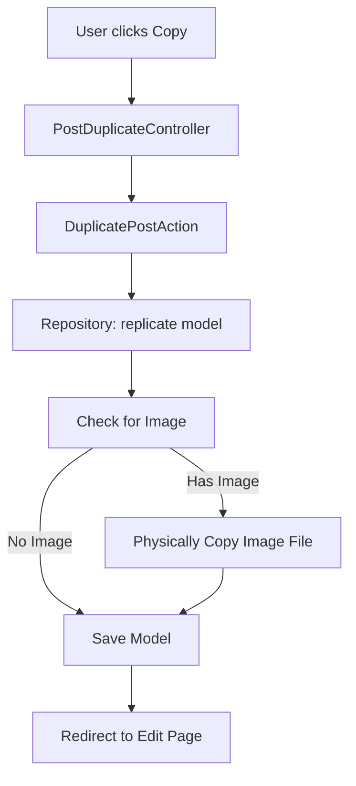
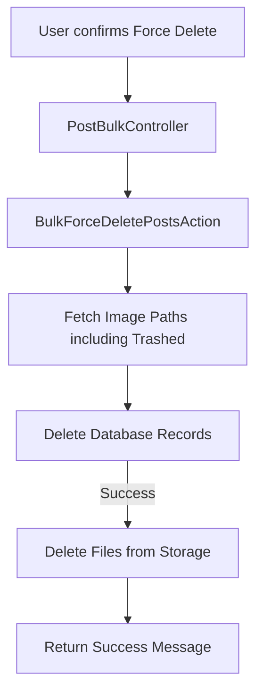

# Post Feature Technical Documentation

This document provides a comprehensive overview of the **Post** feature, covering the technical architecture, business logic, and interaction between the Backend (Laravel) and Frontend (React/Inertia).

---

## 1. High-Level Architecture

The Post feature follows a **Decoupled Architecture** to ensure maintainability and testability:

* **Controller Layer**: Thin controllers that handle HTTP requests and return Inertia responses.
* **Query Layer**: Specialized Query Objects for data retrieval (filtering, sorting, pagination).
* **Service Layer**: Business logic for complex operations (image processing, multi-step updates).
* **Action Layer**: Single-responsibility classes for discrete business tasks (Duplication, Publishing).
* **Repository Layer**: Abstracted database access with support for Caching and Event decorators.

---

## 2. Backend Implementation

### 2.1 Data Flow (Listing)

1. **Request**: `IndexPostRequest` validates filters (`q`, `status`, `category_id`, etc.).
2. **DTO**: Request converts data into `PostQueryDTO`.
3. **Query**: `PostListQuery` executes the retrieval logic using the `Filterable` trait.
4. **Filterable Trait**:
    * **Direct Columns**: Matches keys like `status` to table columns.
    * **Custom Logic**: Uses `filterTagId()` in the `Post` model for many-to-many relationship filtering.

### 2.2 Image Lifecycle & SEO

* **Naming**: Images are named using the pattern: `{slug}-{timestamp}.{extension}` for SEO.
* **Storage**: Handled in `PostService`.
* **Deletion Policy**:
  * **Soft Delete**: The image file is **preserved** in storage.
  * **Force Delete**: The image file is **deleted** from storage.
  * **Update**: When replacing an image, the old file is immediately deleted.

### 2.3 Actions & Bulk Operations

* **Duplicate**: Uses `DuplicatePostAction`. It replicates the model, generates a new slug, and **physically copies** the image file to prevent dependency on the original.
* **Bulk Actions**: Managed by `PostBulkController` and specific actions (`BulkDelete`, `BulkRestore`, `BulkForceDelete`).
  * `BulkForceDelete` fetches image paths **before** database removal to ensure files are cleaned up.

---

## 3. Frontend Implementation (React + Inertia)

### 3.1 Components

* **`PostIndex`**: The main listing page. Manages selection state and bulk action intents.
* **`PostForm`**: Shared component for Create/Edit. Uses **Tabs** to organize Content, Settings, and SEO/Media.
* **`BulkActionsDropdown`**: A dynamic dropdown that triggers the `AlertDialog` for confirmations.
* **`TablePaginationLinks`**: Optimized with Inertia `Link` and `prefetch` for fast navigation.

### 3.2 State Management

* **Selection**: `selectedIds` state tracks which posts are checked in the table.
* **Intents**: `bulkIntent` ('delete', 'forceDelete', 'restore') determines the text and color of the confirmation dialog.

---

## 4. Logical Flow Charts

### Post Duplication Flow

### Force Delete Flow (Bulk/Single)

---

## 5. Summary of Key Files

| Layer | Files |
| :--- | :--- |
| **Model** | `app/Models/Post.php` (Includes `Filterable` and `HasSlug` traits) |
| **Service** | `app/Services/PostService.php` (Image processing, CRUD logic) |
| **Actions** | `app/Actions/Post/` (Publish, Duplicate, Bulk actions) |
| **Controllers** | `app/Http/Controllers/Admin/PostController.php`, `PostBulkController.php` |
| **Frontend** | `resources/js/pages/admin/posts/index.tsx`, `partials/post-form.tsx` |
| **Requests** | `app/Http/Requests/Post/IndexPostRequest.php` (Complex validation) |

---

## 6. Best Practices in this Feature

1. **Naming Convention**: All filter methods in the model must follow `filter{KeyName}`.
2. **SEO Priority**: Image names and Meta tags are prioritized in the `PostForm`.
3. **UI Feedback**: Destructive actions (Delete/Force Delete) use red-themed `AlertDialogs` for safety.
4. **Performance**: Pagination uses `prefetch` to reduce perceived latency.
