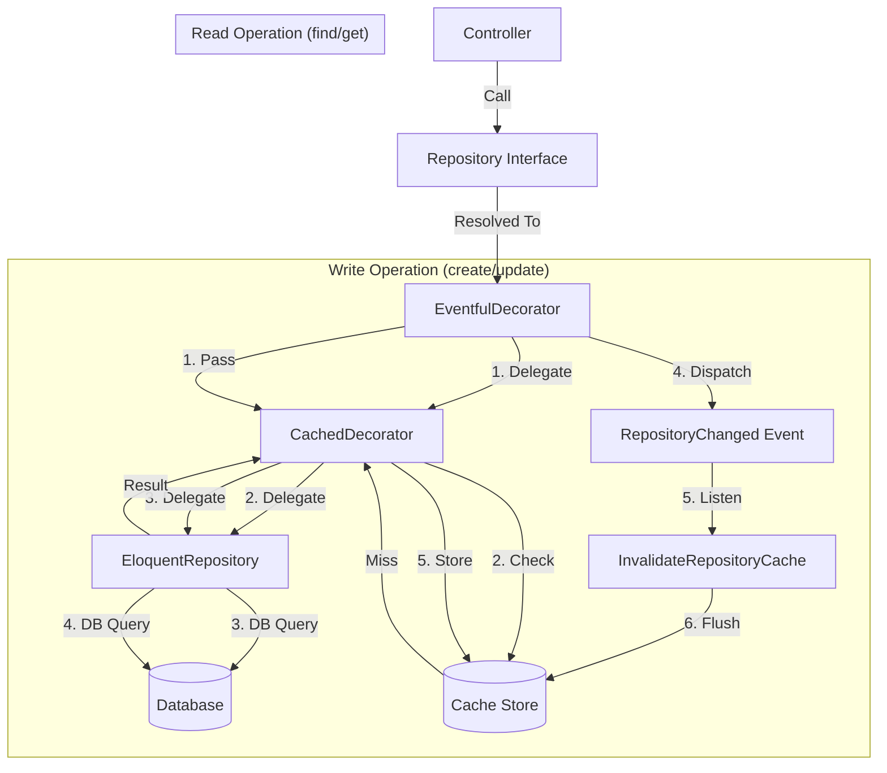

# Repository Pattern with Caching & Events

This project implements a robust **Repository Pattern** enhanced with **Decorator Pattern** to handle Caching and Event dispatching transparently. This ensures that business logic (Controllers/Services) interacts with a clean interface while performance (caching) and side-effects (events) are handled automatically in the background.

## 1. Architecture Overview

We use a **Layered Decorator Stack** to wrap the actual Eloquent Repository.

### The Stack (Outer to Inner)

1. **Eventful Repository (Outer Layer)**:
    * Intercepts "Write" operations (`create`, `update`, `delete`).
    * Delegates the action to the inner layer.
    * Dispatches a `RepositoryChanged` event upon success.
    * *Read operations are passed through.*

2. **Cached Repository (Middle Layer)**:
    * Intercepts "Read" operations (`find`, `getByIds`, `paginate`).
    * Checks the Cache Store (Redis/File) using a unique key.
    * **Hit**: Returns cached data.
    * **Miss**: Calls the inner layer, caches the result, and returns it.
    * *Write operations are passed through.*

3. **Eloquent Repository (Core Layer)**:
    * The actual implementation interacting with the Database via Eloquent Models.

### Visual Flow



## 2. Key Components

### Interfaces (`app/Repositories/Contracts/`)

* `BaseRepositoryInterface`: Standard CRUD methods (`find`, `create`, `update`, `delete`, `paginate`).
* `SoftDeletesRepository`: Adds `restoreMany` and `forceDeleteMany`.
* *Example*: `PostRepositoryInterface` extends both.

### Core Implementation (`app/Repositories/Eloquent/`)

* `BaseRepository`: Abstract class implementing standard Eloquent logic.
* `SoftDeleteRepository`: Trait/Base for soft-deletable models.
* *Example*: `PostRepository` extends `SoftDeleteRepository`.

### Decorators

* **Cache**: `CachedRepository`, `SoftDeleteCachedRepository`.
* **Events**: `EventfulRepository`, `SoftDeleteEventfulRepository`.

## 3. Caching Strategy & Invalidation

We use a **Smart Invalidation Strategy** to avoid clearing the entire cache while ensuring data consistency.

### Cache Keys

Keys are generated using `CacheKeys` helper:

* Format: `{prefix}:{namespace}:{method}:{hash_of_args}:v{version}`
* Example: `repo:PostRepository:find:123:v1`

### Invalidation Logic

When a write operation occurs (`RepositoryChanged` event):

1. **Tag-based (Redis)**: If supported, we flush all keys with the tag `repo:PostRepository`. This is precise and fast.
2. **Version-based (File/Database)**: If tags aren't supported, we increment a "Version Key" (`repo:PostRepository:v`).
    * Old keys become invalid because the generator will now look for `...:v2` instead of `...:v1`.

## 4. How to Add a New Repository

### Option A: Using Artisan Command (Recommended)

The project provides a dedicated command to scaffold all necessary files and register the binding automatically.

```bash
# Standard repository
php artisan make:repo Product

# Repository with Soft Delete capability
php artisan make:repo Product --soft
```

**What this command does:**

1. Creates `ProductRepositoryInterface` in `app/Repositories/Contracts/`.
2. Creates `ProductRepository` in `app/Repositories/Eloquent/`.
3. Creates `CachedProductRepository` in `app/Repositories/Cache/`.
4. Creates `EventfulProductRepository` in `app/Repositories/Decorators/`.
5. Automatically inserts the binding in `app/Providers/RepositoryServiceProvider.php`.

---

### Option B: Manual Creation (Under the Hood)

If you prefer to do it manually or need a very custom setup, follow these steps:

#### Step 1: Create Interface

Create `app/Repositories/Contracts/ProductRepositoryInterface.php`:

```php
namespace App\Repositories\Contracts;

interface ProductRepositoryInterface extends BaseRepositoryInterface
{
    // Add custom methods if needed
}
```

### Step 2: Create Implementation

Create `app/Repositories/Eloquent/ProductRepository.php`:

```php
namespace App\Repositories\Eloquent;

use App\Models\Product;
use App\Repositories\Contracts\ProductRepositoryInterface;

class ProductRepository extends BaseRepository implements ProductRepositoryInterface
{
    public function model(): string
    {
        return Product::class;
    }
}
```

### Step 3: Bind in Service Provider

Open `app/Providers/RepositoryServiceProvider.php` and register the binding in the `register` method:

```php
public function register(): void
{
    // ... other bindings
    $this->bindRepo(ProductRepositoryInterface::class, ProductRepository::class);
}
```

**That's it!** The `bindRepo` method automatically wraps your `ProductRepository` with the `CachedRepository` and `EventfulRepository` decorators.

## 5. Configuration (`config/repository.php`)

| Key | Environment Variable | Default | Description |
| :--- | :--- | :--- | :--- |
| `cache.enabled` | `REPOSITORY_CACHE` | `true` | Master switch for repository caching. |
| `cache.ttl` | `REPOSITORY_CACHE_TTL` | `300` | Cache duration in seconds (5 mins). |
| `cache.prefix` | `REPOSITORY_CACHE_PREFIX` | `repo` | Prefix for cache keys to avoid collisions. |
| `cache.use_tags` | `REPOSITORY_CACHE_TAGS` | `true` | Use Cache Tags if the store supports it (Redis). |

## 6. Advanced: Custom Decorators

If `ProductRepository` needs specific caching logic (e.g., specific keys) or event logic, you can extend the decorators:

1. Create `App\Repositories\Cache\CachedProductRepository` extending `CachedRepository`.
2. Create `App\Repositories\Decorators\EventfulProductRepository` extending `EventfulRepository`.
3. Update `RepositoryServiceProvider` logic to use these specific classes when binding `ProductRepositoryInterface`.

## 7. Troubleshooting

* **Data not updating?** Check if the Queue Listener is running (if events are queued) or if `REPOSITORY_CACHE` is causing sticky data. Try running `php artisan cache:clear`.
* **Cache Tags not working?** Ensure your cache driver is `redis` or `memcached`. `file` and `database` drivers do not support tags (system falls back to versioning).
