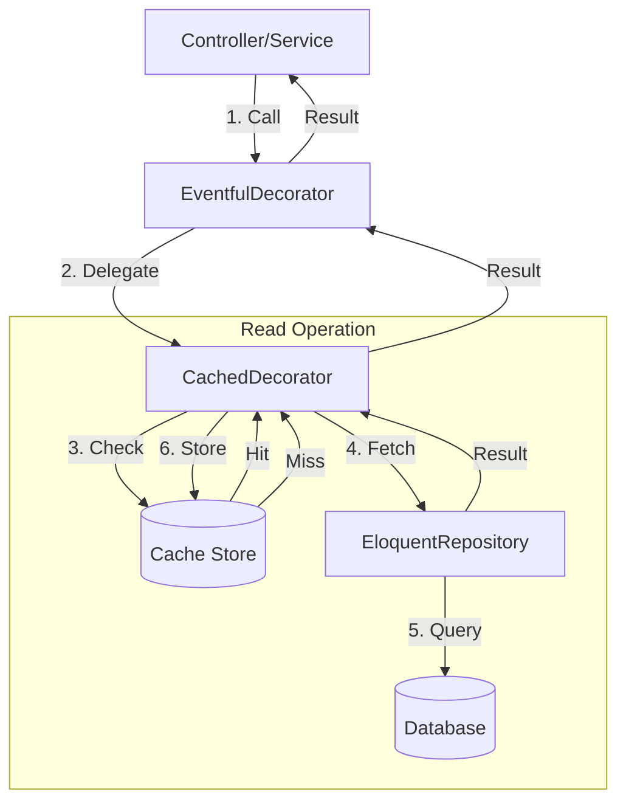
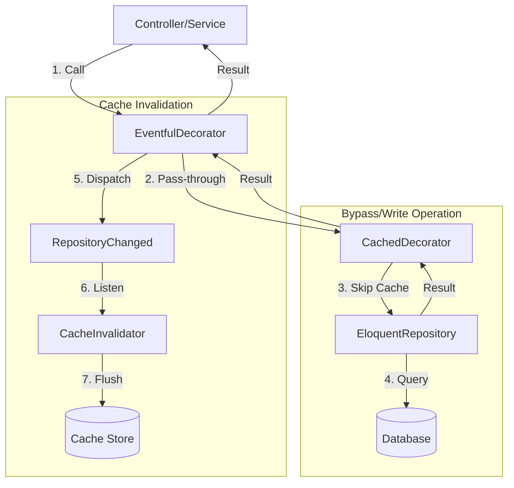
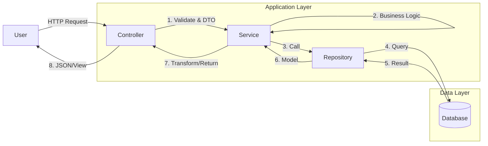

# 📘 Repository Pattern with Caching & Events

> **Status**: Active
> **Pattern**: Decorator + Repository
> **Example Model**: `Post`

This guide details our robust **Repository Pattern** implementation, enhanced with the **Decorator Pattern** to handle Caching and Event dispatching transparently.

---

## 📑 Table of Contents

<details close>
<summary>Click to expand/collapse</summary>

- [📘 Repository Pattern with Caching \& Events](#-repository-pattern-with-caching--events)
	- [📑 Table of Contents](#-table-of-contents)
	- [1. Architecture Overview](#1-architecture-overview)
		- [1.1 Standard Flow (Cached Read)](#11-standard-flow-cached-read)
		- [1.2 Bypass Flow (Write / Lock / No Cache)](#12-bypass-flow-write--lock--no-cache)
	- [2. Why This Architecture?](#2-why-this-architecture)
	- [3. Base Repository API Reference](#3-base-repository-api-reference)
		- [3.1 Read Operations](#31-read-operations)
		- [3.2 Write Operations](#32-write-operations)
		- [3.3 Locking \& Atomic Operations](#33-locking--atomic-operations)
		- [3.4 Soft Delete Operations](#34-soft-delete-operations)
	- [4. Component Breakdown (The "Files")](#4-component-breakdown-the-files)
		- [4.1 The Interface (Contract)](#41-the-interface-contract)
			- [📖 What is it?](#-what-is-it)
			- [❓ Why do we need it?](#-why-do-we-need-it)
			- [🛠 How to use it?](#-how-to-use-it)
			- [📝 Sample](#-sample)
		- [4.2 The Eloquent Implementation (Logic)](#42-the-eloquent-implementation-logic)
			- [📖 What is it?](#-what-is-it-1)
			- [❓ Why do we need it?](#-why-do-we-need-it-1)
			- [🛠 How to use it?](#-how-to-use-it-1)
			- [📝 Sample](#-sample-1)
		- [4.3 The Cache Decorator (Performance)](#43-the-cache-decorator-performance)
			- [📖 What is it?](#-what-is-it-2)
			- [❓ Why do we need it?](#-why-do-we-need-it-2)
			- [🛠 How to use it?](#-how-to-use-it-2)
			- [📝 Sample](#-sample-2)
		- [4.4 The Event Decorator (Side Effects)](#44-the-event-decorator-side-effects)
			- [📖 What is it?](#-what-is-it-3)
			- [❓ Why do we need it?](#-why-do-we-need-it-3)
			- [🛠 How to use it?](#-how-to-use-it-3)
			- [📝 Sample](#-sample-3)
	- [5. Binding It All Together](#5-binding-it-all-together)
			- [📖 What is it?](#-what-is-it-4)
			- [🛠 How to use it?](#-how-to-use-it-4)
			- [📝 Sample](#-sample-4)
	- [6. Service Layer Integration](#6-service-layer-integration)
		- [6.1 The Service-Repository Flow](#61-the-service-repository-flow)
		- [6.2 Why use Services?](#62-why-use-services)
	- [7. Usage Example](#7-usage-example)
	- [8. How to Create a New Repository](#8-how-to-create-a-new-repository)
		- [🚀 The Easy Way (Command)](#-the-easy-way-command)
		- [🛠 The Manual Way (Checklist)](#-the-manual-way-checklist)
	- [9. Directory Structure](#9-directory-structure)
	- [10. Pros and Cons](#10-pros-and-cons)
	- [11. Advanced Features](#11-advanced-features)
		- [11.1 Service Traits (Soft \& Bulk Deletes)](#111-service-traits-soft--bulk-deletes)
		- [11.2 Locking (lockForUpdate / sharedLock)](#112-locking-lockforupdate--sharedlock)

</details>

---

## 1. Architecture Overview

We use a **Layered Decorator Stack** to wrap the actual Eloquent Repository.

### 1.1 Standard Flow (Cached Read)

Used for `find`, `getByIds`, and custom read methods where caching is enabled.



### 1.2 Bypass Flow (Write / Lock / No Cache)

Used when:

1. **Writing**: `create`, `update`, `delete`
2. **Locking**: `lockForUpdate()`, `sharedLock()`
3. **Explicit Bypass**: The repository logic purposely ignores cache.

In this flow, the **Cache Decorator** acts as a transparent pass-through or is explicitly disabled (via `skipCache`).



---

## 2. Why This Architecture?

- **Separation of Concerns**: Your Controller doesn't care about Caching. Your Eloquent model doesn't care about Events. Each layer does exactly one thing.
- **Performance by Default**: Read operations are cached automatically.
- **Consistency**: Every model follows the exact same flow.
- **Testability**: You can easily mock the `PostRepositoryInterface` in your unit tests, ignoring the database entirely.

---


## 3. Base Repository API Reference

Every repository extending `BaseRepository` inherits these methods.

### 3.1 Read Operations
| Method | Description | Usage |
| :--- | :--- | :--- |
| `find` | Find record by ID or null. | `$repo->find($id, $cols, $relations)` |
| `findOrFail` | Find by ID or throw 404. | `$repo->findOrFail($id)` |
| `findBy` | Find one by attribute. | `$repo->findBy('slug', 'my-post')` |
| `getByIds` | Fetch collection from array. | `$repo->getByIds([1, 2, 3])` |
| `paginate` | Paginate with filters/sort. | `$repo->paginate(15, ['*'], ['status' => 'active'])` |

### 3.2 Write Operations
| Method | Description | Usage |
| :--- | :--- | :--- |
| `create` | Store new record. | `$repo->create($data)` |
| `update` | Update record by ID. | `$repo->update($id, $data)` |
| `delete` | Delete one record. | `$repo->delete($id)` |
| `deleteMany` | Bulk delete (Efficient). | `$repo->deleteMany([1, 2, 3])` |

### 3.3 Locking & Atomic Operations
| Method | Description | Usage |
| :--- | :--- | :--- |
| `lockForUpdate` | SELECT ... FOR UPDATE | `$repo->lockForUpdate()->find($id)` |
| `sharedLock` | LOCK IN SHARE MODE | `$repo->sharedLock()->find($id)` |

### 3.4 Soft Delete Operations
| Method | Description | Usage |
| :--- | :--- | :--- |
| `restore` | Restore soft-deleted record. | `$repo->restore($id)` |
| `forceDelete` | Permanent removal. | `$repo->forceDelete($id)` |

---

## 4. Component Breakdown (The "Files")

We will use the **`Post`** model as our primary example.

### 4.1 The Interface (Contract)

**File:** `app/Repositories/Contracts/PostRepositoryInterface.php`

#### 📖 What is it?

A PHP Interface that lists every public method your repository *must* support. It defines the "What", not the "How".

#### ❓ Why do we need it?

1. **Dependency Injection**: We type-hint the interface, not the class. This lets Laravel swap the implementation (e.g., adding cache) without changing your controller code.
2. **Mocking**: In tests, we can easily create a "FakePostRepository" that implements this interface, making tests 100x faster.

#### 🛠 How to use it?

Extend `BaseRepositoryInterface` and add your custom method signatures.

#### 📝 Sample

```php
interface PostRepositoryInterface extends BaseRepositoryInterface
{
    // ✅ Good: Typed arguments and return types
    public function getPublishedPosts(int $limit = 10): LengthAwarePaginator;

    // ✅ Good: Specific business query
    public function findBySlug(string $slug): ?Post;
}
```

---

### 4.2 The Eloquent Implementation (Logic)

**File:** `app/Repositories/Eloquent/PostRepository.php`

#### 📖 What is it?

The actual code that speaks to the Database. This is where you write Eloquent queries, scopes, and joins.

#### ❓ Why do we need it?

To keep complex SQL logic out of your Controllers and Services. If you need to change how "Published Posts" are found, you change it here, in one place.

#### 🛠 How to use it?

Extend `BaseRepository` and implement your interface.

#### 📝 Sample

```php
class PostRepository extends BaseRepository implements PostRepositoryInterface
{
    // Mandatory: Define the model class
    public function model(): string
    {
        return Post::class;
    }

    public function getPublishedPosts(int $limit = 10): LengthAwarePaginator
    {
        // 💡 Tip: Use scopes defined in your Model for cleaner code
        return $this->query()
            ->with(['author', 'tags']) // Eager load relationships
            ->where('status', 'published')
            ->where('published_at', '<=', now())
            ->orderByDesc('published_at')
            ->paginate($limit);
    }
}
```

---
****

### 4.3 The Cache Decorator (Performance)

**File:** `app/Repositories/Cache/CachedPostRepository.php`

#### 📖 What is it?

A wrapper class that intercepts calls to your repository. If the result is in the cache (Redis), it returns it immediately. If not, it calls the real repository and saves the result.

#### ❓ Why do we need it?

To drastically improve read performance. A complex query might take 100ms; pulling it from Redis takes 1ms.

#### 🛠 How to use it?

Extend `CachedRepository`. Override only the **Read** methods you want to cache. Wrap the call in `$this->remember()`.

#### 📝 Sample

```php
class CachedPostRepository extends CachedRepository implements PostRepositoryInterface
{
    public function getPublishedPosts(int $limit = 10): LengthAwarePaginator
    {
        // 🔑 Key Strategy: Include ALL variables that affect the result in the key parts.
        // If we didn't include 'page', page 2 would show page 1's cached data!
        return $this->remember(
            method: 'getPublishedPosts', 
            parts: [$limit, request('page', 1)], 
            callback: fn() => $this->inner->getPublishedPosts($limit)
        );
    }
}
```

---

### 4.4 The Event Decorator (Side Effects)

**File:** `app/Repositories/Decorators/EventfulPostRepository.php`

#### 📖 What is it?

A wrapper that triggers a `RepositoryChanged` event whenever a **Write** operation (Create, Update, Delete) occurs.

#### ❓ Why do we need it?

1. **Cache Clearing**: When data changes, we must delete the old cache. This decorator does it automatically.
2. **Decoupling**: You don't need to manually call `$cache->forget()` in your controller.

#### 🛠 How to use it?

Extend `EventfulRepository`.

- **Usually, you leave this empty!** The parent class automatically handles `create`, `update`, `delete`.
- Only add code here if you have a *custom* write method.

#### 📝 Sample

```php
class EventfulPostRepository extends EventfulRepository implements PostRepositoryInterface
{
    // Standard methods (create, update, delete) are ALREADY handled by the parent.
    
    // 💡 Example: A custom write method needs to be wrapped manually
    public function restore(int|string $id): bool
    {
        $result = $this->inner->restore($id);
        
        // Dispatch event to clear cache
        Event::dispatch(new RepositoryChanged($this->namespace));
        
        return $result;
    }
}
```

---

## 5. Binding It All Together

**File:** `app/Providers/RepositoryServiceProvider.php`

#### 📖 What is it?

The configuration file that tells Laravel how to wire these 4 files together.

#### 🛠 How to use it?

Use the `bindRepo` helper in the `register` method.

#### 📝 Sample

```php
public function register(): void
{
    // This single line does the magic:
    // Interface -> Eventful -> Cached -> Eloquent
    $this->bindRepo(PostRepositoryInterface::class, PostRepository::class);
}
```

---

## 6. Service Layer Integration

While Repositories handle **Data Access**, Services handle **Business Logic**.

### 6.1 The Service-Repository Flow

The Controller should generally talk to the **Service**, not the Repository directly (unless it's a simple read operation).



### 6.2 Why use Services?

1. **Multiple Repositories**: A `CreateOrderService` might need to talk to `OrderRepository`, `ProductRepository`, and `UserRepository`. The Service orchestrates this.
2. **Transactions**: The Service defines the transaction boundary (using `TransactionTrait`).
3. **Complex Validation**: Business rules that go beyond simple field validation live here.

**Example Service:**

```php
class PostService
{
    use TransactionTrait;

    public function __construct(
        protected PostRepositoryInterface $postRepo,
        protected TagRepositoryInterface $tagRepo
    ) {}

    public function createWithTags(array $data, array $tags): Post
    {
        // 🛡️ Transaction ensures atomic integrity
        return $this->transaction(function() use ($data, $tags) {
            
            // 1. Create Post (Write)
            $post = $this->postRepo->create($data);
            
            // 2. Sync Tags (Orchestration)
            if (!empty($tags)) {
                $post->tags()->sync($tags);
            }
            
            return $post;
        });
    }
}
```

---

## 7. Usage Example

In your Controller:

```php
class PostController extends Controller
{
    public function __construct(
        protected PostService $postService,
        protected PostRepositoryInterface $postRepo // Optional: Direct read for simple lists
    ) {}

    public function index()
    {
        // ✅ Read: Safe to use Repository directly for simple listing
        return $this->postRepo->paginate();
    }
    
    public function store(Request $request)
    {
        // 🛡️ Write: Always go through Service for business logic/transactions
        $this->postService->createWithTags(
            $request->validated(), 
            $request->input('tags', [])
        );
    }
}
```

---

## 8. How to Create a New Repository

We have a dedicated Artisan command to generate all 4 files and register the binding for you.

### 🚀 The Easy Way (Command)

```bash
# Standard Repository
php artisan make:repo Post

# With Soft Deletes support
php artisan make:repo Post --soft
```

### 🛠 The Manual Way (Checklist)

1. Create **`Contracts/PostRepositoryInterface.php`**
2. Create **`Eloquent/PostRepository.php`**
3. Create **`Cache/CachedPostRepository.php`**
4. Create **`Decorators/EventfulPostRepository.php`**
5. Register in **`RepositoryServiceProvider.php`**

---

## 9. Directory Structure

Your `app/Repositories` folder will look like this:

```
app/Repositories/
├── Contracts/                  # 1. Interfaces
├── Eloquent/                   # 2. Database Logic
├── Cache/                      # 3. Cache Logic
└── Decorators/                 # 4. Event Logic
```

---

## 10. Pros and Cons

| Feature | Pros | Cons |
| :--- | :--- | :--- |
| **Separation** | Code is clean, focused, and follows SOLID principles. | More files to manage (4 files per model). |
| **Caching** | Automatic, robust, and centralized. | Developers must remember to add cache wrappers for custom methods. |
| **Performance** | Significant speedup for read-heavy apps. | Slight overhead in function calls (negligible). |

---

## 11. Advanced Features

### 11.1 Service Traits (Soft & Bulk Deletes)

To keep your Services clean, we provide traits that handle common deletion patterns.

**Usage in Service:**

```php
use App\Services\Traits\BulkDeleteServiceTrait;
use App\Services\Traits\SoftDeleteServiceTrait;

class PostService
{
    use BulkDeleteServiceTrait; // Adds: bulkDelete(array $ids)
    use SoftDeleteServiceTrait; // Adds: restore($id), bulkRestore($ids), forceDelete($id)...
}
```

### 11.2 Locking (lockForUpdate / sharedLock)

We support database locking with a fluent API that works seamlessly with our Decorator stack (Cache/Event).

**Key Features:**

- **Dynamic Switching**: You can switch on locking per query.
- **Cache Safety**: When you lock, the **Cache is automatically bypassed** for that request to ensure you get fresh data.
- **Auto-Reset**: The lock is consumed by the next query and immediately reset.

**Examples:**

```php
// 1. Pessimistic Write Lock (SELECT ... FOR UPDATE)
// This will bypass Redis, lock the row in MySQL, and return the model.
$post = $this->repository->lockForUpdate()->find($id);

// 2. Shared Lock (SELECT ... LOCK IN SHARE MODE)
$post = $this->repository->sharedLock()->find($id);

// 3. Transaction with Lock
$this->transaction(function() use ($id) {
    // Lock fresh data
    $post = $this->repository->lockForUpdate()->find($id);
    // ... modify ...
    $post->save();
});
```
