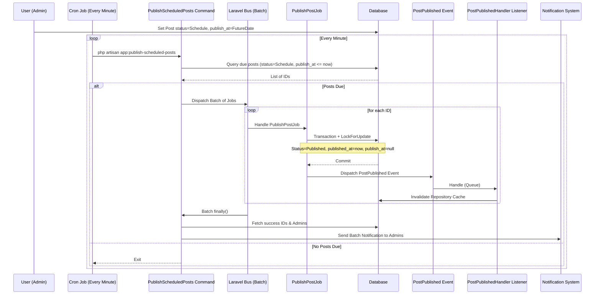

# Scheduled Publishing Feature Guide

This document provides a comprehensive overview of the Scheduled Publishing feature, including technical implementation, performance optimizations, and server configuration.

## 1. Feature Overview

The Scheduled Publishing feature allows authors to set a specific future date and time for a post to go live. The system automatically handles the transition from `Schedule` to `Published` state without manual intervention.

## 2. Technical Flow Diagram



## 3. Technical Implementation

### Core Components

- **Model:** `app/Models/Post.php` - Uses `scopeScheduledToPublish` to filter due posts.
- **Validation:** `app/Rules/ValidPublishedAt.php` - Ensures dates are in the future when status is `Schedule`.
- **Command:** `app/Console/Commands/PublishScheduledPosts.php` - The entry point triggered by the scheduler. Uses Laravel Batches for atomic execution tracking.
- **Job:** `app/Jobs/PublishPostJob.php` - **Queued**. Performs the status transition within a database transaction with a pessimistic lock (`lockForUpdate`).
- **Event:** `app/Events/PostPublished.php` - Domain event triggered for each successfully published post.
- **Listener:** `app/Listeners/PostPublishedHandler.php` - **Queued**. Handles side effects:
  - Invalidate `PostRepository` cache (Tags/Version bumping).
  - Future: Social media autoposting, Follower notifications.

### Database Optimization

A composite index ensures that the lookup for due posts is $O(log N)$:

```sql
CREATE INDEX posts_status_publish_at_index ON posts (status, publish_at);
```

### Performance & Scaling

- **Batching:** Multiple scheduled posts are dispatched as a single batch. This allows the system to send a **single summary notification** to admins after the entire process is complete, instead of spamming one email per post.
- **Concurrency:** `lockForUpdate()` prevents race conditions if the command is manually triggered while the scheduler is running.
- **Queueing:** All heavy lifting (status updates, cache clearing, notifications) is done in the background.

## 4. How to Use (Admin Dashboard)

1. **Create/Edit Post**: Open the post editor.
2. **Status**: Change status to **Schedule**.
3. **Date**: Select a future date/time in the **Scheduled For** field.
4. **Save**: Click Save. The post will remain hidden until the chosen time.

## 5. Server Configuration

### Task Scheduler

The scheduler must run every minute to ensure timely publication:

```bash
* * * * * cd /path-to-your-project && php artisan schedule:run >> /dev/null 2>&1
```

### Queue Worker

Ensure supervisor is managing your queue workers to process `PublishPostJob`:

```bash
php artisan queue:work --tries=3 --backoff=5,30,120
```

## 6. Maintenance & Debugging

- **Manual Trigger**: `php artisan app:publish-scheduled-posts`
- **Check Status**: Use `php artisan queue:failed` to see if any publishing jobs failed.
- **Logs**: Batch results and notification counts are logged to `storage/logs/laravel.log`.
